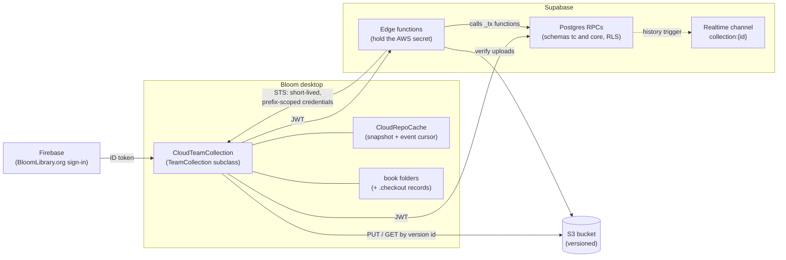
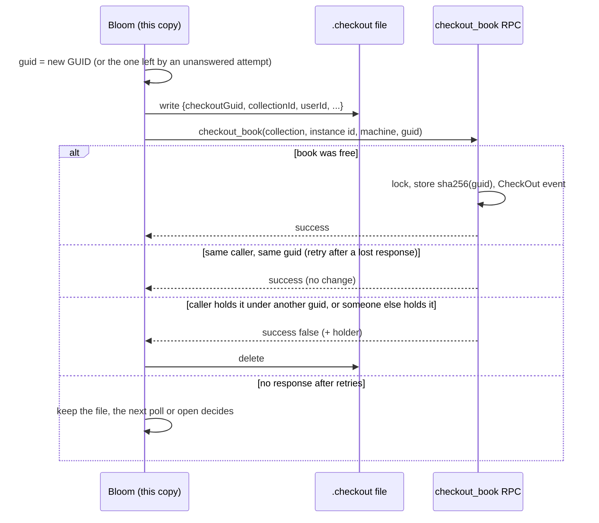
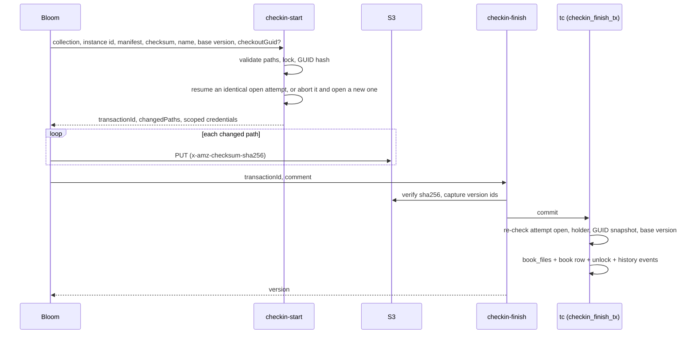
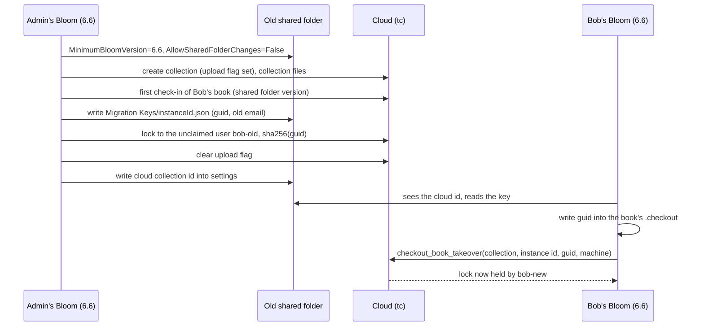
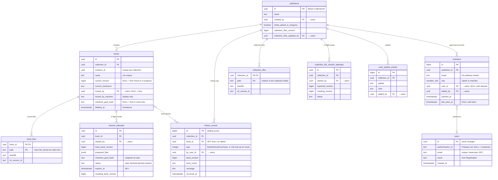

# Cloud Team Collections

A design overview for developers new to Cloud Team Collections: what they are for, how the parts
fit together, how a book moves through checkout and check-in, what the database looks like, and
what is still open.

> **Where things are.**
>
> - **This document** is `team-collections/docs/DESIGN.md` in `bloom-core-supabase`, beside
>   `CONTRACTS.md` (the wire contract), `SCHEMA.md` (schema notes) and `GOING-LIVE.md`
>   (deployment runbook). A copy for discussion and comments is on Notion
>   ([Cloud Team Collections design](https://app.notion.com/p/3ea20c4397cb81d2935adefb1ca293ef)),
>   and the project's requirements are drafted there too
>   ([Cloud Team Collections requirements](https://app.notion.com/p/3eb20c4397cb813e8501ec6f0cce2e9b)).
> - **Server** (Postgres schemas `tc` and `core`, RLS, RPCs, edge functions, local dev stack): this
>   repository, PR #13, branch `BL-16531-tc-backend`. Not deployed anywhere yet. It implements the
>   data model described here and `CONTRACTS.md` v2.0.
> - **Desktop client** (`CloudTeamCollection` and its helpers, the sign-in and join UI, unit and
>   E2E tests): BloomDesktop draft PR #8052, branch `cloud-tc-for-review`. It still speaks the
>   earlier contract (v1.12), and needs the client work of
>   [section 9](#9-planned-work-and-open-questions) to work with this server.
> - **The Share dialog** (who has access, and in what role): BloomDesktop PR #8394, branch
>   `BL-16673-share-dialog`. It stores its data in a local stand-in file until it is wired to the
>   server (see [Sharing UI](#sharing-ui-built)).
> - **The freeze for migration** (the `AllowSharedFolderChanges` setting of
>   [section 5](#5-starting-a-cloud-collection-initial-upload-and-migration)): BloomDesktop PR
>   #8414, branch `BL-16928-shared-folder-changes`.
>
> Tracking: YouTrack BL-16531 (the whole feature, targeted at 6.6) and the cards tagged
> **Sharing** (BL-16672 to BL-16676, BL-16527).

## 1. Goals

Folder-based Team Collections wrap a shared Dropbox or LAN folder. They are hard for users to set
up, Bloom can never know for sure what the sync agent has delivered, and a third-party sync
underneath Bloom produces a long tail of races (conflicted copies, half-delivered books, zip files
that look corrupt because they are still arriving). Cloud Team Collections replace the shared
folder with a service Bloom controls:

1. **Sharing is controlled by Bloom.** An admin gives people access by entering the email address
   of their BloomLibrary.org account; each person signs in to Bloom with that account. No Dropbox,
   no shared folder, no third-party account.
2. **Reliability comes from the database.** Locks, versions and history live in a transactional
   Postgres database, so most of the old races become impossible rather than merely handled. Every
   change of state is one atomic database transaction.
3. **The editorial model is unchanged.** Books are still checked out, edited (offline if need be)
   and checked in. Content moves only on explicit, progress-reported transfers ("Send" and
   "Receive"); metadata (who has what checked out, which version exists) stays current in the
   background.
4. **Work is never silently lost.** Whenever the shared version must win over local work, the local
   work is saved as a `.bloomSource` in the collection's `Lost and Found` folder and recorded as an
   incident in the history.
5. **Coexistence.** Cloud Team Collections are a second implementation behind the existing
   `TeamCollection` abstraction; folder Team Collections keep working unchanged.

Non-goals for the first release: keeping old versions of books (S3 versioning is used only as a
transactional safety net), sharing single books, and server-side subscription enforcement (the
client's subscription-tier gate is the only check).

Cloud Team Collections are not part of Bloom 6.5. They are to be fully live in 6.6, though perhaps
still marked experimental. No environment variable gates them; the `cloudCollections` variable
that hides the opt-in checkbox in the #8052 client goes when the Share dialog replaces that
checkbox.

## 2. Architecture



- **Bloom desktop.** `CloudTeamCollection` subclasses the abstract `TeamCollection`, so
  `SyncAtStartup`, the conflict logic, the message log and most of the Team Collection UI are
  shared with folder Team Collections. Helpers: `CloudCollectionClient` (RPC and edge-function
  calls), `CloudRepoCache` (a thread-safe, disk-persisted snapshot of server state plus the event
  cursor, which also serves the Disconnected state when offline), `CloudBookTransfer` and
  `BookVersionManifest` (per-file delta upload and download), `CloudCheckoutFile` (the `.checkout`
  record), `CloudCollectionMonitor` (polling), `CloudAuth` with its Firebase and local providers,
  and `CloudJoinFlow`. `TeamCollectionLink.txt` holds either a folder path or
  `cloud://sil.bloom/collection/<collectionId>`, and the factory picks the subclass from it; an
  older Bloom reads a cloud link as a missing folder and lands in the Disconnected state.
- **Postgres RPCs** run inside the database and are exposed by PostgREST at `/rest/v1/rpc/...`
  (schema `tc`, so calls carry `Content-Profile: tc`). Row-level security gates every call;
  clients never write tables directly. Single-step database work is an RPC. The `core` schema,
  which holds `users`, is not exposed through the API at all; only SECURITY DEFINER functions in
  `tc` reach it.
- **Edge functions** are TypeScript on Supabase's edge runtime, at `/functions/v1/<name>`. They are
  the only code holding the AWS secret, so anything that vends S3 credentials or verifies S3 objects
  is an edge function. They call internal `_tx` database functions to commit. The finish functions
  call those with the service-role key; members cannot call them directly.
- **S3.** One bucket per environment, object versioning on, lifecycle rules that abort stale
  multipart uploads and expire non-current versions after about 7 days. Edge functions hand the
  client STS credentials scoped by an inline session policy: write access only to the one book
  being sent (1 hour), or read access (`GetObject` + `GetObjectVersion`) to the collection prefix.
- **Realtime.** An `AFTER INSERT` trigger on `tc.history_events` broadcasts each event on the
  private channel `collection:{uuid}` (event name `tc_event`, members only). The client does not
  subscribe yet: it polls, and realtime is an optimization for later, never a dependency.
- **Environments** are chosen by configuration (`BLOOM_CLOUDTC_*`), never by code: **local** (the
  on-machine emulation: local Supabase plus MinIO), **dev/sandbox** (a hosted test project with
  real S3) and **production**.

## 3. Identity, membership and roles

### Identity

A person is a row in **`core.users`**, with an id of Bloom's own that never changes. They sign in
with their **BloomLibrary.org account**, using Supabase's third-party Firebase auth: the
BloomLibrary login page hands Bloom the Firebase ID and refresh tokens it already has (#8052 adds a
`POST /bloom/api/external/cloudLogin` endpoint for this, next to the existing `external/login`), and
every request carries the Firebase ID token as its bearer JWT. The server never trusts an identity
the client sends: `tc.current_user_id()`, which every RPC uses to find the caller, looks the token's
`sub` up in `core.users.authentication_id` and returns `users.id`, or NULL for someone with no row,
which counts as "not a member of anything". Lock holders and history authors are `users.id` values
taken that way. The machine name the client sends is for display only.

- **Rows are created only when needed.** `claim_memberships()` creates a person's row when it finds
  an invitation for the token's verified email, and `create_collection` creates one for a
  collection's first admin. Someone who signs in with nothing to join gets no row.
- **`users.email`** is the current sign-in email (lowercase, NFC), refreshed from the token.
- **`users.name`** is the first and last name from the person's Bloom Registration dialog. Bloom
  sends it with `claim_memberships()` at every sign-in, so correcting one's registration corrects
  the name everywhere, history included. Nobody edits another person's name. Someone invited but
  not yet signed in is shown by email. The registration belongs to the computer, so someone who
  signs in on another person's computer takes that registration's name until they next sign in on
  their own.
- **The client learns its own `users.id`** from `claim_memberships()`, and uses it to recognize its
  own locks; the `.checkout` record keeps it.
- **Unclaimed users** are rows with an email and no `authentication_id`, so nobody can sign in as
  one. They hold checkouts carried over from a folder Team Collection (see
  [section 5](#3-books-checked-out-to-others-in-the-old-system)). The first verified sign-in with
  that email claims the row, instead of a new row being made, so `users.email` stays unique.
- **An email change is a database-admin task.** If Firebase keeps the uid, nothing is needed: the
  next sign-in refreshes `users.email`. If the person has a new Firebase account, a support script
  (`team-collections/support/move-user-to-login.ps1`) finds the row by its current email and sets
  its `authentication_id` and `email` to the new account's; it refuses if the new account or email
  already has a row, which would make it a merge. Merging two users (re-pointing the
  identity columns, and settling a collection both belong to) is written when first needed.
- **One login per person.** If a person ever needs several logins at once, `authentication_id` and
  `email` move to a `core.user_identities` table and `current_user_id()` looks there; the foreign
  keys, which all point at `users.id`, don't change.

### Members and invitations

`tc.members` is the list of approved accounts for a collection. An admin adds a row by email
(lowercased and NFC-normalized) with a role; the row has no `user_id` until the person signs in and
`claim_memberships()` fills it in, which requires a verified email. So "invited" means a row with
no `user_id`, and "joined" means a claimed row. `members.email` stays the address the person was
invited by; once the row is claimed, their current email is `users.email`. Adding the row is all
that inviting someone involves: nothing is sent, and the invitation card the person sees in Bloom
comes from `my_collections()` listing that row. `my_collections()` lists the collections an email
has been approved for, claimed or not, which is what the join UI shows. `members_list` is visible
to any member; `members_add`, `members_remove` and `members_set_role` are admin-only, and
`members_add` treats an email matching either a row's invited address or a joined member's current
email as already having access. Removing a member also force-unlocks everything they had checked
out, with a ForcedUnlock event for each book.

A trigger (`members_last_admin_guard`) refuses to delete or demote a collection's last admin,
locking the collection row first so two concurrent demotions cannot both succeed. If a collection
loses every reachable admin anyway, the Bloom team can run `support_set_admin` with the
service-role key (see `GOING-LIVE.md`, "Admin recovery").

### Roles

There are two roles. The UI calls them **Admin** and **Editor**; the database enum
`tc.member_role` calls them `admin` and `member`.

| Role   | May                                                                 |
| ------ | ------------------------------------------------------------------- |
| Editor | add, remove and edit books (check out, check in, delete a book they hold) |
| Admin  | everything an Editor may, plus collection settings and other collection files, sharing, force unlock, undelete |

The server enforces the admin rights: collection files, sharing, force unlock and undelete all
require an admin.

A person who opens a cloud collection in a folder another account joined is checked at open. If
the signed-in account is not a member, Bloom refuses to open the collection, naming the signed-in
account, the admins to ask, and the last person known to have used that folder. If it is a member,
Bloom claims the membership if needed and opens normally (see
[Transferring a checkout to a new login](#transferring-a-local-checkout-to-a-new-login)).

### Sharing UI (built)

PR #8394 adds a **Share** button to the Collection tab's top bar, next to Settings and Other
Collection. It opens **Share "&lt;collection name&gt;"** (`src/BloomBrowserUI/sharing/ShareDialog.tsx`,
served by `src/BloomExe/web/controllers/SharingApi.cs`, with the model and rules in
`src/BloomExe/Sharing/`):

- **Sign in first.** Signed out, the dialog asks you to sign in to BloomLibrary.org (through
  `AccountApi`); invitees use their own BloomLibrary.org accounts.
- **Start sharing.** A collection is shared only when an admin presses **Start sharing**. Until
  then the dialog is a preview and saves nothing (`GET sharing/state` writes nothing), so closing
  it leaves everything as it was. It explains what sharing does, lists read-only **who will have
  access** (you, as Admin, and, for a folder Team Collection, everyone its history shows has
  worked in it: **Admin** if they are in the Team Collection's administrators list, **Editor**
  otherwise, each "last seen" at their last recorded action), and, for a Team Collection, states
  what happens to it: it is frozen for everyone, people keep what they have checked out but need
  Bloom 6.6 to go on, older Blooms won't open it, and this can't be undone from Bloom. Start is
  enabled only for someone signed in who may edit the collection's settings (for a Team
  Collection, one of its administrators); otherwise the sign-in prompt, or a note that only an
  administrator can share it, says why. `SharingApi.CanStart` is where the later conditions go
  (a subscription that allows sharing, BL-16672; being online). For a Team Collection, Start asks
  for confirmation in a small dialog (Start sharing / Cancel); an ordinary collection starts at
  once. `POST sharing/start` then saves the previewed people as the members, all or none, and is
  refused if the collection is already shared. The invite box appears only after that; inviting
  to an unshared collection is refused. Removing someone who should not be there is done
  afterwards, like any other change.
- **Invite by email address**, choosing Admin or Editor. Inviting only adds the address to the
  list of people allowed to use the collection; no email is sent (see "Being invited" below for how
  the person finds out). An invitation is all-or-nothing: if any address in a request already has
  access or appears twice, nothing is added. The email box and button are disabled while an
  invitation is being saved.
- **The member list** shows each person with their role. Under the role: **"Last seen &lt;when&gt;"**
  once Bloom knows they have used the collection (a signed-in member's visit is recorded when the
  collection opens and when the dialog loads), otherwise **"Invited &lt;when&gt;"**.
- **Admins manage others.** An admin can change another person's role or **Remove from
  collection** through a menu on that person's role. Nobody can change their own role or remove
  themself (a tooltip explains that another admin must do it). Because only admins can change
  anything and the one doing it stays an admin, a shared collection always has an admin. Editors
  see the same list read-only. Changes take effect immediately; the dialog has Close, not OK and
  Cancel (the pattern of Google Drive, Figma and Notion). Removed people stay removed; nothing
  re-adds the Team Collection's history people once sharing has started.
- **Learn about sharing** opens the Team Collections introduction in the browser until a sharing
  page exists.

**The backend behind this dialog is a stand-in.** `ICollectionSharingService` is implemented only
by `LocalFileCollectionSharingService`, which keeps the record in `sharing.local.json` in the
collection folder and enforces the rules the server will. Nobody invited sees an invitation card
yet, and a folder Team Collection does not sync the file. Starting to share only sets up the
list of people; its books do not move anywhere yet (the design for that is
[section 5](#5-starting-a-cloud-collection-initial-upload-and-migration)).
`src/BloomExe/Sharing/CollectionSharingStarter.cs` runs the steps of starting in section 5's
order, and those that need what isn't built yet are separate methods that do nothing:

- `FreezeOldTeamCollection` (Team Collection only): set `AllowSharedFolderChanges=False` and
  `MinimumBloomVersion=6.6` in the old shared folder's settings. Waits for #8414, and for a cloud
  collection that really replaces the old one.
- `RequireNewerBloomForCloudCollection` (every collection): set `MinimumBloomVersion=6.6` in the
  collection's own settings before they are uploaded. Deliberately not done by the stand-in:
  with no real cloud collection it would only lock this collection away from older Blooms on
  this computer, and a Team Collection pushes its settings to the shared folder when they are
  saved, so it would lock every teammate still on 6.5 out of a collection that has not moved.
- `ICollectionSharingService.StartSharing`: create the cloud collection, with its initial-upload
  flag set, and its members. The stand-in writes the members to `sharing.local.json`.
- `StartInitialUpload`: the background sender of first check-ins (with, for a Team Collection,
  the `Migration Keys` and the locks of books checked out in the old system), then clearing the
  flag. When it exists, `sharing/state` is where its progress would come from for an "Uploading N
  of M books" line in the dialog.

### Sharing UI (planned, from the Sharing cards)

These are designs on cards, not built:

- **Subscription states** (BL-16672, Ready For UI Review). A Pro subscription lets you share with
  one other person, with an "upgrade your subscription" banner; a subscription without sharing
  shows the dialog with a "choose a subscription" banner and only yourself in the list.
- **Removing** (BL-16674, Ready For Work). Removing a joined member asks for confirmation: their
  copy stays on their computer but stops syncing, and if invited again they must download the whole
  collection again. A pending invitation's menu offers **Cancel invitation** (no follow-up dialog)
  and marks the row "Invite pending". Races between showing the menu and choosing an item are
  handled in whatever way is simplest.
- **Being invited** (BL-16675, Ready For Work; BL-16527, Open). Invitations are not emailed. When
  someone signed in to Bloom is allowed to use a cloud collection they have not joined yet, a
  special invitation card appears pinned first in Open/Create Collections, with **Download and
  Join**, and a badge on the Other Collection button. A first-time user must be asked to sign in
  before this screen.
- **Moving a folder Team Collection to the cloud** (BL-16676, Ready For UI Review). A mocked
  five-step dialog; the mechanism behind it is
  [section 5](#5-starting-a-cloud-collection-initial-upload-and-migration), in which the shared
  folder is frozen at once, the admin uploads in the background, people keep editing what they
  have checked out, and each member's 6.6 Bloom switches over by itself, carrying its checkouts
  with it, when the upload is done. So the mockup's preparation phase and waiting for everyone
  don't apply, and the dialog needs redesigning around section 5 (see
  [section 9](#9-planned-work-and-open-questions)). The #8394 Start sharing step, with its preview
  of the history's people and its statement of what happens to the Team Collection, is the first
  piece of it.

## 4. The book lifecycle

### Book identity and local state

A book is identified by its **instance id** (from `meta.json`), never by its name. `tc.books` is
unique on `(collection_id, instance_id)`, deleted books included, and S3 keys use the instance id,
so a rename changes no files. The API names a book by its collection id and instance id; the
table's own key, `books.id`, is used only inside the database. (The instance id alone isn't
enough: the same book can be in two collections.)

Names don't identify anything, and they aren't unique:

- **Each copy chooses its own folder names.** Bloom names a book's folder from the book's own
  content: its title, or the name a user chose with Rename, which is kept in `meta.json` beside
  `nameLocked`. If that folder name is already taken locally, Bloom adds a suffix, as it already
  does, so two copies of a collection can name the same book's folder differently ("The Moon" and
  "The Moon1") when two books want the same name.
- **The main `.htm` is stored as `index.htm`** in the manifest and in S3, whatever the local folder
  is called. The client maps it to and from the local `<folder>.htm` when it builds a manifest (as
  it already maps a key to a differently spelled local path, `LocalRelativePath`) and when it
  downloads. So every copy's manifest lists the same files, and a rename changes no files at all.
  Only the main `.htm` is mapped: the upload filter passes no other `.htm`. Anything that compares a
  local book with the cloud one uses manifest keys, not names on disk.
- **`books.name`** is the name the book should have, as the sender computed it (never a folder name
  with a local suffix). It is only for display: status, the join list and history, before anything
  is downloaded. A check-in updates it; nothing enforces its uniqueness.

Locally, each book folder holds the book, the usual Team Collection status file, and, while the
book is checked out in that copy, a `.checkout` record. `CloudRepoCache` remembers the last server
state it saw and the local version each book was received or sent at. For books the server has and
this copy hasn't received yet, the client assigns a local folder name when it first sees them.

### Checkout: the checkout GUID

A checkout belongs to **one copy of the book folder**, identified by a random GUID:

- **The client makes the GUID and writes it first.** It generates the GUID (lowercase "D" form),
  writes `<bookFolder>/.checkout` (BOM-free JSON: `version`, `checkoutGuid`, `collectionId`,
  `userId`, `checkedOutAt`), and only then calls `checkout_book(collection, instance id, machine,
  guid)`. If the record can't be written, it doesn't ask. Writing first means a checkout whose
  response is lost can never strand the book.
- **The server stores only a hash**, `tc.books.checkout_guid_hash =
  lowercase-hex(SHA-256(UTF-8(lower(guid))))`. The hash is readable by members and comes back on
  every book row from `get_collection_state` and `get_changes` as `checkoutGuidHash`; a hash of 122
  random bits can't be reversed. The GUID itself is stored nowhere on the server.
- **Outcomes.** A free book is locked to the caller with the hash. The same caller retrying with
  the **same** GUID gets the same success again, changing nothing and emitting no second event, so
  a lost response is simply retried (the client retries twice with short delays). The caller
  holding the book under a **different** GUID (another copy), or under a send-only lock, gets
  `{success: false, locked_by_me: true}` and nothing changes. Someone else's lock gets the holder's
  identity. On any refusal the client deletes the record it wrote; if the outcome stays unknown it
  keeps the record and the next poll or open decides.
- **"Checked out here" means "in this copy".** A copy is where the book is checked out exactly when
  the server row is locked and the hash of the GUID in that copy's `.checkout` equals
  `checkoutGuidHash`. The machine doesn't matter, so a collection folder that is moved, renamed or
  copied to another computer keeps its checkouts. A copy without the current GUID sees the book as
  read-only, even for the same user; the way out is to go back to the copy that has it, or an
  admin's force unlock.
- The `.checkout` record never leaves the folder: it is not uploaded, packaged, copied into
  duplicates or publications, or zipped into Lost and Found copies.



### Obsolete `.checkout` records

At collection open, and after each poll that touched books, the client looks at every book folder
with a `.checkout`. The record is **obsolete** when the server row is unlocked or its
`checkoutGuidHash` isn't the hash of the record's GUID: the book was checked in or out from another
copy (for example the other half of a duplicated collection folder), an admin force-unlocked it, or
another account holds it. Cancelling an obsolete checkout:

1. If the local book is exactly the committed version (typically our own check-in committed but
   its answer was lost), delete the record and record the book as current, silently.
2. Otherwise, if the local book changed since the last sync, save it to Lost and Found (a
   WorkPreservedLocally incident, sub-case `ObsoleteCheckout`); delete the record; receive the
   repository version.

A book that might be open for editing (it is the selected book) is only made read-only; its
cancellation is retried on later polls and at the next open. While disconnected, a record is
trusted as it stands.

### Check-in: two-phase check-in attempts

A check-in ("Send") is one **check-in attempt**, a row in `tc.checkin_attempts`, which the database
commits in one step:

1. **`checkin-start`** receives the book's collection id and instance id, the full proposed manifest
   (`files: [{path, sha256, size}]`, with the main `.htm` as `index.htm`), the checksum, the
   proposed name, the book version the copy is based on, and `checkoutGuid` for a book the caller
   has checked out. It NFC-normalizes and validates every path, checks the lock and the GUID, gets
   S3 credentials **before** taking any lock, and diffs the manifest against the current version.
   If the caller already has an open attempt for this book, it is **resumed only if its proposal
   would be identical** (the same files, changed paths, checksum, base version, GUID snapshot and
   proposed name), which just extends its expiry; otherwise it is aborted and a new attempt opened.
   A new book's first check-in keeps its uncommitted book row, and only the attempt is replaced. The
   attempt records the book's current version as its base, and the book's current
   `checkout_guid_hash` as a snapshot. Start returns `transactionId` (the attempt's id),
   `changedPaths` and write credentials for `tc/{cid}/books/{instanceId}/*`.
2. The client **uploads** each changed file to `prefix + changedPath` exactly as returned, with
   `x-amz-checksum-sha256`.
3. **`checkin-finish`** verifies every changed object's SHA-256 in S3, captures the S3 version ids,
   and calls `checkin_finish_tx`, which under row locks re-checks that the attempt is still open,
   that the caller still holds the lock, that the book still has the snapshot hash, and that the
   book is still at the base version. Then, in one transaction, it sets the book's
   `current_version` to the next number, replaces the book's `book_files`, updates the book row
   (checksum, name), releases the lock (unless `keepCheckedOut`, which keeps the lock and the GUID),
   records the new version on the attempt (`resulting_book_version`) and writes history events. A
   best-effort manifest backup is then written to S3.

Because a start either leaves an open attempt exactly as it is or aborts it, a finish still running
for an older attempt commits either exactly what the newer start wants, or nothing: it can only
ever commit the proposal of the start that returned its id.

Failure modes are all "nothing committed, try again": `MissingOrBadUploads` (re-upload the listed
paths; `stalePaths` names uploads older than the 24-hour commit window), `transaction_aborted` (a
newer start replaced this attempt; the client treats it as superseded, not as an error),
`LockHeldByOther`, `CheckoutElsewhere` (the checkout moved to another copy since start),
`BaseVersionSuperseded` (receive and re-send), `InvalidManifest`, `TransactionExpired`,
`ClientOutOfDate` (426, from `tc.min_supported_client_version()`). A finish that already committed
returns the same `{version}` when repeated, from the attempt's `resulting_book_version`, so finish
is retried with the same attempt on a lost response. `checkin-abort` is idempotent (an unknown
attempt is a 200 no-op).

**Keeping the attempts table small.** An open attempt lives 48 hours and is resumable; after that
the reaper, which runs at every start, marks it expired. The reaper also deletes a finished attempt
once its expiry has passed (a repeated finish only comes from the same Bloom session, which keeps
the attempt id in memory). Aborted and expired attempts are the orphaned-upload sweep's worklist, and
the sweep deletes each one once a complete run has deleted its uploads. So the table holds only
attempts in progress and recently ended ones; the record of check-ins that happened is the history.

**Send-only locks.** A check-in never creates a checkout and never returns a GUID. A **first
check-in** of a new book creates the book row locked to the sender with **no hash and no current
version**, so it is invisible to teammates until it commits; resuming it needs only the same user
and instance id. A check-in of an existing **free** book takes a send-only lock with no hash (and
emits a CheckOut event). In both cases finish always releases the lock, even with
`keepCheckedOut`, as do abort and expiry. So a first check-in never leaves the book checked out.
Check-ins to deleted books are refused.

**Unconfirmed check-ins.** If finish was sent but no answer came back, the client records the
check-in as unconfirmed. Until the server settles it, the book is treated as checked in: read-only,
and its `.checkout` is kept. Each successful poll, and any attempt to check out or check in that
book, tries to settle it (retrying finish, which is idempotent, or reading the book's state). The
record is kept in memory; after a restart, reconciliation settles the same question from the
server's state and the local content.



### Versions, manifests and Receive

A book's **version is a number per book**, `books.current_version`, which each commit increases by
one; NULL means a first check-in is still in progress. The history of versions is the book's
CheckIn events, each of which records the version number, the comment, the author, the Bloom
version and the time. Each commit **replaces** the book's rows in `book_files` (path, sha256, size,
`s3_version_id`), so `book_files` is simply the files that make up the book now, and
`books.current_checksum` is their checksum.

Receiving: `get_collection_state` gives the full or delta snapshot, `SyncAtStartup` reconciles it
with the local folders, `get_book_manifest(collection, instance id)` gives the current file list,
`download-start` vends read credentials, and the client downloads only files whose hash differs,
**always by `(path, s3VersionId)`, never "latest"**, into a temp folder that is swapped in
atomically per book. There is no secondary local copy of the repository. A never-committed book is
invisible to everyone except its sender.

**Collection files** (the `.bloomCollection`, custom styles, `configuration.txt`, the reader-tools
settings, and the `Allowed Words` and `Sample Texts` folders) are **one set per collection**, sent
the same two-phase way: `collection-files-start`/`-finish`, **admin-only**, with optimistic
concurrency on the collection's `collection_files_version` (a `VersionConflict` means receive first;
the repository wins), and `get_collection_file_manifest(collection)` for receiving. Paths are
relative to the collection folder (`Allowed Words/...`, `Sample Texts/...`, top-level files). Which
local files count as collection files is Bloom's rule, a filter on paths, so a new kind of
collection file needs no server change, though the Bloom versions sharing a collection must agree
on it. Color palette entries are merged by union (`add_palette_colors`) and never deleted (whether
the backend should hold palettes at all is open; see section 9).

### Polling, realtime and history

The client keeps a `last_seen_event_id` cursor. `get_changes(since)` returns the new history
events and the book rows they touched, and serves both catch-up after reconnecting and the
60-second polling loop. `tc.history_events` is both each collection's history and its change feed,
so every event has a `collection_id`. Every lock change of a visible book produces an event, so a
poll always sees new lock state: CheckOut (0), CheckIn (1), Created (2), Renamed (3), ForcedUnlock
(5), Deleted (8), Moved (9), plus the cloud types WorkPreservedLocally (100, logged by the client),
CheckOutReleased (101: `unlock_book`, or the release of an aborted or expired attempt's send-only
lock) and CollectionFilesCheckIn (102, which has no book). Book event type numbers match
`BookHistoryEventType`. `log_event`, for events the client logs, requires a book for the types that
concern a book. History shows each author's current `users.name`, and the book's name as it was
(`book_name`), so it reads sensibly after a rename or a delete. For cloud collections the History
tab reads these server events (cached for offline display); the SQLite-in-book history is for
folder Team Collections.

### Reconciliation at startup and Lost and Found

`SyncAtStartup`'s existing cases run against the cache. Before they run, the cloud client cancels
obsolete checkouts (above) and quietly records as current any local book whose content is exactly
the committed version (the case of a check-in that committed just before a crash). Whenever the
repository has to win over local work (a conflicting edit or checkout, an obsolete checkout with
local changes), the local book is zipped into `<collection>/Lost and Found/<name>.bloomSource` and a
WorkPreservedLocally event is logged, so admins can see it happened.

### Unlock, force unlock, member removal, delete

- **`unlock_book(collection, instance id, guid)`** (undo checkout) needs the holder's GUID; it
  removes the `.checkout` and emits CheckOutReleased.
- **`force_unlock(collection, instance id)`** is admin-only, needs no GUID, and emits ForcedUnlock
  with the old lock in `lock_info`. The copy that held the checkout finds its record obsolete at its
  next poll or open and cancels it there, preserving any edits in Lost and Found. The checkout is
  not restored when that computer comes back.
- **Removing a member** force-unlocks their books the same way.
- **`delete_book(collection, instance id, guid)`** requires the caller to hold the lock and present
  the GUID; it sets the `deleted_at` tombstone. `undelete_book` (admin) clears it.

A trigger (`books_clear_checkout_on_unlock`) clears `checkout_guid_hash` whenever the lock is
released or passes to another account without a new GUID, so no unlock path can leave a stale hash.
The one deliberate exception is takeover, below.

### Transferring a local checkout to a new login

The checkout belongs to the copy, not the account, and that is what lets it pass to a new login.

- Bloom opened on a collection folder by a different signed-in account first checks membership: a
  non-member is refused (see [Roles](#roles)); a member's membership is claimed if needed.
- A book checked out in this copy by another account shows as checked out to that account, but is
  **editable here**, because this copy holds the GUID.
- The server lock moves to the new account on the first check-in from this copy (or an explicit
  check-out attempt): the client calls `checkout_book_takeover(collection, instance id, guid,
  machine)`, presenting the GUID from `.checkout`. The server reassigns a different account's lock
  to the caller only when the GUID matches (the member-readable hash is not accepted), keeps the
  same GUID, records the new machine, and emits a CheckOut event by the new account; otherwise it
  does nothing. The client rewrites the record's `userId`. The check-in that follows is attributed
  to the new account.
- Copies that don't hold the GUID can't take a checkout over, for the same user or anyone else.
- A person whose login has changed and whose user row a database admin has moved to the new login
  (see [Identity](#identity)) needs no takeover: the lock already belongs to their user.

## 5. Starting a cloud collection: initial upload and migration

The server side is in PR #13, and the freeze in #8414; the rest of the client is designed, not
built yet. Besides those, it reuses: first check-in, checkout with a client-made GUID,
`checkout_book_takeover`, `force_unlock`, `MinimumBloomVersion` (BL-16690, honored since 6.4) and
the Share dialog's list of people from Team Collection history. The work it needs is listed in
[section 9](#9-planned-work-and-open-questions).

The aims: a new cloud collection is set up and usable quickly; the admin doing the uploading is
never frozen; and the temporary upload period needs as little special-case code as possible, even
if things look slightly odd meanwhile. The same process serves sharing an ordinary collection and
moving a folder Team Collection to the cloud, and the admin's 6.6 Bloom does all of it. Nobody has
to check in first, and nobody waits for anyone.

### 1. Start

(Migration only.) The admin's Bloom sets two values in the **old shared folder's** collection
settings (the `.bloomCollection` in `Other/Other Collection Files.zip`):

- **`MinimumBloomVersion=6.6`** (BL-16690, honored since 6.4). A 6.4 or 6.5 Bloom is shut out of
  the collection entirely, at startup and mid-session, and told to upgrade. Someone with books
  checked out on an older Bloom keeps their edits on disk but can't touch them until they have
  upgraded; their 6.6 Bloom then carries those checkouts over (step 5).
- **`AllowSharedFolderChanges=False`** (BL-16928, new in 6.6). A 6.6 Bloom that is still on the
  old system, because the upload isn't finished, treats the Team Collection as **Disconnected**:
  `FolderTeamCollection.CheckConnection()`, which runs at startup and before every check-out,
  check-in, Forget Changes and Force Unlock, reports the pause as the connection problem, and a
  running Bloom switches as soon as it notices the shared settings change. Disconnected mode
  already blocks every write to the shared folder while leaving books checked out here and new
  local books editable. The status dialog and book panel say why: changes are paused, or, once
  `CloudCollectionId` is there, the collection has moved to cloud sharing and reopening it
  switches over.

Right after setting them, the old shared folder is made **read-only for everyone except the admin
doing the migration**, as a safeguard against Blooms too old to honor `MinimumBloomVersion`
(before 6.4). On Dropbox, the folder's Dropbox owner (who may not be the Bloom admin) changes every
other member to "Can view"; on a LAN share it is done with file-system permissions. Bloom can
neither do nor verify this, so the migration UI lists it as a checklist step. Every later write to
the old folder (the `Migration Keys` files, the cloud id in the settings) is the admin's, and 6.6
members that have switched only read it (the settings and their keys) and check in to the cloud,
so the restriction doesn't affect them. Whether it makes an old Bloom fail fast depends on the sync
service (see [section 9](#9-planned-work-and-open-questions)); even where it doesn't, it keeps very
old Blooms from changing what everyone else sees.

For **every** collection that becomes a cloud collection, Team Collection or not, the admin's Bloom
also sets `MinimumBloomVersion=6.6` in the collection's own settings before they are uploaded. The
cloud copy of the settings, and so every member's copy downloaded from it, then shuts out older
Blooms. An older Bloom would otherwise open the folder as an ordinary collection (or, for a former
Team Collection, as one whose shared folder is missing) and could change books behind the cloud's
back.

The admin's Bloom then creates the cloud collection in the database with its **initial upload in
progress** flag set, and uploads the collection files.

### 2. Upload

From now on, on the admin's machine only, the collection is a cloud collection. Every book the
server doesn't have yet is simply a new local book, editable as new books always are. The admin's
Bloom sends them in the background, one at a time, as ordinary first check-ins, skipping the book
that is open. An uploaded book is checked in; the admin checks it out normally to edit it. After a
crash or a network loss the upload just resumes: what remains is the local books the server
doesn't have, and a first check-in whose answer was lost is already reconciled by checksum.

Which content is uploaded: for a book checked out to someone else in the old system, the old
shared folder's checked-in version; for the admin's own checkouts, the admin's local copy.

### 3. Books checked out to others in the old system

Take Sally, whose old checkout email matches her BloomLibrary.org login, and Bob, whose old
checkout says `bob-old@example.com` but who signs in as `bob-new@example.com`. For each such book,
after uploading it, the admin's Bloom:

1. generates a checkout GUID;
2. writes the **key file** `Migration Keys/<instanceId>.json` in the old shared folder, holding
   `cloudCollectionId`, `instanceId`, `bookName` (informational), `checkoutGuid`, `oldEmail` and
   `oldMachine`. `Migration Keys` is a new folder at the shared folder's root, beside `Books`,
   `Other` and `Lost and Found`; 6.5 watches only `Books` and `Other` and ignores it. The key is
   written **before** the lock is taken (write-ahead, like `.checkout`);
3. locks the book with `lock_book_for_legacy_checkout` (admin-only) to **the user with the old
   email**: the existing `core.users` row with that email, or else a new **unclaimed user** with
   that email and no login. The lock has that GUID's hash and the old machine name. The RPC is
   allowed only while the upload flag is set and only on a free, committed book, and repeating it
   with the same GUID succeeds again with no change (for resuming after a crash). Its CheckOut event
   names the admin as the actor, with the holder in `lock_info`, so History can show whose checkout
   it really is.

Nobody can sign in as an unclaimed user, so nobody can check such a book in or unlock it normally,
while takeover (by GUID) and admin force unlock work unchanged. The book shows as checked out to
`bob-old@example.com`. Every "who holds this book" check stays a test of one column. Instance ids
are unique within a collection (Bloom won't open a collection until duplicates are fixed), so one
key per instance id needs no further check.

### 4. Finish

When every book is uploaded (including the checked-in versions of the books others hold) and every
key is written, the admin's Bloom clears the flag, then writes the cloud collection's id into the
old shared folder's collection settings. From then on it is an ordinary, fully working cloud
collection with no pending states.

### 5. Other members switch over

A member's 6.6 Bloom switches when it sees the cloud id in the old shared settings, which appears
only once the upload is done. `my_collections()`, the joinable list behind the invitation card in
Open/Create Collections, skips collections whose flag is still set, which also keeps invitees who
were never in the old Team Collection out until then. The patch's block on pushing collection
settings stops a 6.5 admin overwriting the shared settings and dropping the cloud id.

On switching, for each book whose old-system record says it is checked out to the old email on
this machine, the client reads the key by the local book's instance id (so a local rename doesn't
matter) and writes the GUID into the book's `.checkout`. Then:

- **Sally**, signing in with the old email, claims the unclaimed user row that holds her locks, so
  the locks are already hers.
- **Bob**, signing in as `bob-new`, has a user of his own; the client calls
  `checkout_book_takeover`, which moves each lock to him. Takeover doesn't care that the login
  differs. The unclaimed row for `bob-old` is left holding nothing.

This happens before the usual startup reconciliation, which then sees an ordinary checkout in this
copy based on the uploaded version; check-in, rename and delete go through the cloud as usual
(delete presents the GUID).

- **Membership.** The person must be a member. People from the Team Collection's history are added
  when the admin starts sharing it (see [Sharing UI](#sharing-ui-built)), with their last activity
  available to seed `last_seen_at`; someone whose login differs, like Bob, is invited by their real
  BloomLibrary.org email in the Share dialog. A non-member is refused by the existing open-time
  check, which names the admins.
- **A key that hasn't arrived.** A sync service can deliver files out of order, so a book whose key
  is missing stays read-only, and the client retries on later polls.
- **Keys are not cleaned up.** A GUID is useless once that checkout ends.
- **An owner who never switches.** An admin force-unlocks the book. The old shared folder must stay
  until everyone who had checkouts has switched.
- **Security.** Anyone who can read the old shared folder could use a key, which is the same trust
  the old Team Collection gave them. Bloom uses a key only for a book recorded as checked out to
  that old email on this machine.



### 6. If it goes badly wrong

If, say, the admin's computer dies mid-upload, a database admin deletes the incomplete cloud
collection with a support script (by collection id: its database rows and its S3 prefix);
`MinimumBloomVersion` and `AllowSharedFolderChanges` are reset in the old shared settings (or left
for the next attempt), and so is the other members' write access to the old folder; the
`Migration Keys` folder is deleted; and someone else is made admin and starts again. There is no UI
for this.

### Sharing an ordinary collection

Steps 1, 2 and 4 without the parts about the old shared folder. Invitations can be added at any
time, but invitees don't see them until the flag clears.

## 6. Database schema

The declarative source is `supabase/schemas/tc/01_schema.sql` to `04_security.sql` (plus the `core`
schema for `users`); the tables are in `03_tables.sql`. Key columns only; lines are enforced foreign
keys. A column that points at `users` says "→ users" rather than being drawn as a line, except
`members.user_id`, which is how a person belongs to a collection. `checkin_attempts` is drawn from
its book only; its `collection_id` is a convenience copy of the book's.



- **`core.users`**: one row per person (see [Identity](#identity)). `authentication_id` is unique
  where set; `email` is unique. Reached only through SECURITY DEFINER functions.
- **`collections`**: one row per cloud collection; `id` is the Bloom CollectionId, the same value
  as in `TeamCollectionLink.txt`. Everything else in `tc` cascades from it. It also holds the
  collection files' version counter, and who updated them when.
- **`members`**: the approved accounts and their roles (see
  [section 3](#3-identity-membership-and-roles)). Unique by `(collection_id, email)` and by
  `(collection_id, user_id)` for claimed rows. RLS decides every other table's access from the
  caller's claimed `members` row. `last_seen_at` records when that person last had this collection
  open: `get_collection_state` (opening or syncing) and `get_changes` (the 60-second poll) set it to
  now, but at most once every 10 minutes, so an active member costs about one small write per 10
  minutes and no events. `members_list` returns it, and the Share dialog shows it as "Last seen".
- **`books`**: authoritative state of each book: identity (unique on `(collection_id,
  instance_id)`, tombstones included), display name, its current version and checksum, the lock
  (`locked_by`, `locked_by_machine`, `locked_at`), `checkout_guid_hash`, and the `deleted_at`
  tombstone. A book with no `current_version` is a first check-in in progress.
- **`book_files`**: the files that make up each book now, keyed by `(book_id, path)`, with the S3
  version id of each file so downloads get exactly the committed bytes.
- **`checkin_attempts`**: in-flight and recently ended check-ins: the proposed manifest, changed
  paths, base version, GUID-hash snapshot, status and expiry, and the resulting version once
  finished. Rows are deleted once nothing needs them (see
  [Check-in](#check-in-two-phase-check-in-attempts)).
- **`history_events`**: the append-only history log, the realtime source (via trigger) and the
  polling cursor (`id`). `book_id` survives deletion as NULL so history outlives the book.
- **`collection_files`** / **`collection_file_checkin_attempts`**: the collection-level analogue of
  book files and check-in attempts, one set per collection, with optimistic concurrency on
  `collections.collection_files_version`.
- **`color_palette_entries`**: union-merged palette colors.

Triggers NFC-normalize book names and file paths. The only indexes are the unique constraints and
those the queries need; none repeats a unique constraint's leading column.

## 7. Server API surface (summary)

Full request and response shapes, error codes and version history are in
[`CONTRACTS.md`](CONTRACTS.md). All RPCs take `p_`-prefixed JSON keys. A book is named by collection
id and instance id everywhere.

| Area            | RPCs / edge functions                                                    |
| --------------- | ------------------------------------------------------------------------ |
| Collections     | `create_collection(..., initial_upload?)` (caller becomes its sole admin), `my_collections`, `claim_memberships` (records the Registration name, returns the caller's user id) |
| Migration       | `finish_initial_upload` (admin), `lock_book_for_legacy_checkout` (admin, only while the upload flag is set); see [section 5](#5-starting-a-cloud-collection-initial-upload-and-migration) |
| State           | `get_collection_state(collection, since?)`, `get_changes(collection, since)`, `get_book_manifest(collection, instance id)`, `get_collection_file_manifest(collection)` |
| Locks           | `checkout_book(collection, instance id, machine, guid)`, `checkout_book_takeover(collection, instance id, guid, machine)`, `unlock_book(collection, instance id, guid)`, `force_unlock(collection, instance id)` (admin) |
| Books           | `delete_book(collection, instance id, guid)`, `undelete_book(collection, instance id)` (admin) |
| Members         | `members_list`, `members_add`, `members_remove`, `members_set_role` (admin) |
| Other           | `add_palette_colors`, `log_event` (client-originated history entries)    |
| Edge: books     | `checkin-start`, `checkin-finish`, `checkin-abort`, `download-start`    |
| Edge: coll. files | `collection-files-start`, `collection-files-finish` (admin)            |
| Ops only        | `sweep-stale-uploads`, `support_set_admin`, `support_delete_collection`, and the support script that moves a user to a new login (all service role) |

The orphaned-upload sweep deletes S3 versions uploaded by check-in attempts that never committed,
but only after a 48-hour grace; because finish never commits an upload older than its 24-hour commit
window, the sweep can never delete a version that is being committed.

**S3 layout** (keys NFC-normalized; the main `.htm` is `index.htm`):

```
tc/{collectionId}/books/{bookInstanceId}/{relativePath}
tc/{collectionId}/books/{bookInstanceId}/.manifest.json            latest manifest backup
tc/{collectionId}/books/{bookInstanceId}/.manifests/{version}.json backup of each version
tc/{collectionId}/collectionFiles/{relativePath}                   the collection files
```

The manifest backups are best-effort copies; the database is the source of truth and nothing reads
them yet.

## 8. Testing

- **Server** (`bloom-core-supabase`): pgTAP database tests (RLS matrix, checkout concurrency and the
  GUID rules, last-admin guard, event cursor, tombstones, sweep worklist), run in CI on every PR;
  Deno unit tests for each edge function.
- **Client** (#8052): C# unit tests under `src/BloomTests/TeamCollection/Cloud/`, including the
  `SyncAtStartup` matrix and checkout-GUID cases; a Playwright-over-CDP E2E harness driving two real
  Bloom instances against the local stack (collaboration, contention, kill-mid-Send and
  kill-after-commit, account switch, new-book lifecycle, checkout GUID scenarios). The existing
  folder Team Collection suite must keep passing unchanged.
- **Share dialog** (#8394): C# tests of the sharing service and history-members logic, and vitest
  tests of the dialog.

## 9. Planned work and open questions

**The server** (PR #13) implements this design and CONTRACTS v2.0, with pgTAP and Deno tests.

**Bringing the client to this design** (#8052, which speaks CONTRACTS v1.12):

- Identifying the signed-in person, lock holders and history authors by `users.id` (the `.checkout`
  record's `userId`); sending the Registration name with `claim_memberships()`.
- Naming books by instance id in every call, which removes the instance-id-to-book-id map and the
  extra state request after a first check-in.
- Choosing folder names locally, with a suffix when taken, and assigning one to each book first
  seen on the server; keeping a name chosen with Rename in `meta.json`; sending the name the book
  should have; mapping `index.htm`; comparing books by manifest keys.
- Treating `transaction_aborted` on a superseded finish as superseded; one collection-file set.
- Moving a book between collections with Bloom's **Move into &lt;collection name&gt;** command.
  Moving out of a cloud collection goes through the abstraction's delete, which is `delete_book`
  and needs the checkout: `CollectionModel` deletes the book from the source collection before it
  clears the book's local-only files (the `.checkout` record included), so the GUID is still there to
  present. A book moved into a cloud collection arrives as a new local book and goes up as a first
  check-in. Not yet handled: a book moved back into a cloud collection it was moved out of has a
  tombstone there with the same instance id, and a first check-in of a deleted book's instance id is
  refused (`book_not_found`). Either that check-in revives the tombstone, as `undelete_book` would,
  or the client gives the book a new instance id; to be decided.

**Wiring and deployment**

- Deploy the backend (GOING-LIVE Phases 2 to 5: hosted projects, buckets, IAM, Firebase claim,
  scheduling the sweep) and merge #13 and the client.
- Implement `ICollectionSharingService` on the Supabase RPCs, replacing `sharing.local.json`, and
  reconcile the Share dialog's sign-in (`AccountApi`) with the #8052 client's `CloudAuth`. The Share
  dialog and the planned cards then replace the #8052 client's Sharing panel in Settings, its join
  cards in the collection chooser and its sign-in dialog.
- The server rules the Share dialog relies on: all-or-nothing invitations (`members_add` adds one
  email at a time and ignores an existing one, so this needs a batch RPC or a transaction), and
  nobody changing their own role or removing themself (the server has only the last-admin guard).
- When a folder Team Collection is shared, the people its history brings in are added as members,
  and the last-activity times from that history can be written into `tc.members.last_seen_at`.
- If realtime ever replaces polling, `get_changes` would run only on reconnect, so "last seen"
  would need another touch point for members who stay connected.

**Starting a cloud collection** (designed in
[section 5](#5-starting-a-cloud-collection-initial-upload-and-migration); BL-16676, BL-16928)

- Client (filling in the empty steps of `CollectionSharingStarter`, see
  [Sharing UI](#sharing-ui-built)): `AllowSharedFolderChanges` (BL-16928, #8414); setting
  `MinimumBloomVersion=6.6` on every collection that becomes a cloud collection; the background
  sender of first check-ins; writing the `Migration Keys` files and the locks of books checked out
  in the old system; finishing (clearing the flag and writing the cloud id into the old shared
  settings); and each member's switch-over with its takeovers.
- `support_delete_collection` should run only once the admin's Bloom has stopped, since S3
  credentials already handed out stay valid for up to an hour.
- Whether making the old shared folder read-only makes an old Bloom fail fast depends on the sync
  service. On a LAN share a write is refused with an error. On a Dropbox "Can view" folder the
  desktop app may still let the local copy be written and just never upload it, so an old Bloom
  could believe its check-in worked. This needs a quick test with two Dropbox accounts. (Folder
  Team Collections don't work over OneDrive or Google Drive, so only Dropbox and LAN shares
  matter.)
- The UI of BL-16676 needs redesigning around this: there is no preparation phase to wait through,
  and each member's Bloom switches when the upload is done, so what members are shown then (the
  mockup's Accept / Not Now, or just a notice) is for the designer.

**Sharing UI** (designed, not built): subscription-tier states (BL-16672); remove confirmation and
cancel-invitation (BL-16674); receiving an invitation in Open/Create (BL-16675, BL-16527), including
sign-in before that screen and whether invitations can be declined; what a removed-then-re-invited
person gets (a second copy of the collection, or the existing join-with-local-copy logic); what
becomes of the Team Collection status button and dialog alongside the Share button.

**Open decisions**

- **Should the backend hold color palettes at all?** JohnH isn't comfortable with palettes being
  part of the backend and doubts they're worth it. The alternative is to keep palettes in a
  collection file like other settings, which only an admin sends, so everyone else's palette
  additions would stay local.
- **Should the server keep a book name at all?** JohnH's view is that anything based on names is
  bugs waiting to happen. The plan keeps `books.name` only for display (status, the join list,
  history) and derives folder names locally from each book's own content, with no uniqueness;
  dropping it would mean showing books the copy hasn't downloaded yet some other way.
- **Checkout and transfer:** whether to offer "Check out here instead" for a copy that lacks the
  GUID (it would give this copy a new GUID and make the other copy's checkout obsolete; with the
  UI designer); whether to make an account-switch takeover visible (it is silent, and the book's
  status names the old account until the first check-in); and what to do about the old account's
  membership, since invitations are keyed by email and a pending invitation to the old email
  doesn't follow the person.
- **Keeping a book checked out after its first check-in** would take a client-made GUID like
  `checkout_book`; not planned yet.
- **The wider direction** (BL-16531, JohnH): pushing any book to the cloud, possibly
  automatically; sharing individual books with per-person permissions (read, edit, publish,
  delete); showing checkout UI only when someone else can edit; sharing storage with BloomLibrary
  publishing; keeping managed old versions instead of expiring them after 7 days. Whether any of
  this changes 6.6 is the first open question of the
  [requirements draft](https://app.notion.com/p/3eb20c4397cb813e8501ec6f0cce2e9b).

**Known limitations**

- Uploads of a first check-in that expires without committing are not swept (the reaper deletes the
  book row, so the sweep's worklist never sees them); harmless orphans until an inventory-based
  cleanup exists.
- The client polls every 60 seconds; subscribing to the realtime channel is later work.
