# Cloud Team Collections — database schema (`tc` and `core`)

> **Status:** the schema of CONTRACTS v2.0, described in `DESIGN.md` and implemented by the
> declarative schema in `supabase/schemas/`. Paths under `src/` refer to the BloomDesktop repo, where
> the desktop client lives.

Entity-relationship diagram of the Supabase Postgres `tc` schema, and the `core.users` table it
refers to. The tables live in `supabase/schemas/tc/03_tables.sql`. Renders on GitHub and in any
mermaid-aware viewer. See `CONTRACTS.md` for the RPC and edge-function surface that reads and
writes these tables (clients never write them directly: all changes go through RLS-gated RPCs and
edge functions), including how the schema is maintained declaratively.

Lines are enforced foreign keys. A column that points at `users` says "→ users" rather than being
drawn as a line, except `members.user_id`, which is how a person belongs to a collection.
`checkin_attempts` is drawn from its book only; its `collection_id` is a convenience copy of the
book's.

```mermaid
erDiagram
    collections ||--o{ books : contains
    collections ||--o{ members : "approved accounts"
    collections ||--o{ history_events : "history log"
    collections ||--o{ collection_files : "collection files"
    collections ||--o{ collection_file_checkin_attempts : "in-flight sends"
    collections ||--o{ color_palette_entries : palette
    books ||--o{ book_files : "current files"
    books ||--o{ checkin_attempts : "in-flight sends"
    books |o--o{ history_events : "book events"
    members }o--o| users : "claimed as"

    collections {
        uuid id PK "Bloom CollectionId"
        text name
        uuid created_by FK "→ users"
        timestamptz created_at
        boolean initial_upload_in_progress "set only at creation"
        bigint collection_files_version "optimistic concurrency"
        timestamptz collection_files_updated_at
        uuid collection_files_updated_by FK "→ users"
    }
    members {
        bigint id PK
        uuid collection_id FK
        text email "the address invited; lowercase, NFC"
        member_role role "admin | member"
        uuid user_id FK "→ users, NULL until claimed"
        uuid added_by FK "→ users"
        timestamptz added_at
        timestamptz claimed_at
        timestamptz last_seen_at "NULL = never seen"
    }
    books {
        uuid id PK "internal; the API uses instance_id"
        uuid collection_id FK
        uuid instance_id "Bloom book identity; unique per collection"
        text name "display only; not unique"
        bigint current_version "NULL = first check-in in progress"
        text current_checksum
        uuid locked_by FK "→ users, NULL = free"
        text locked_by_machine "display only"
        timestamptz locked_at
        text checkout_guid_hash "hex SHA-256 of the checkout GUID; member-readable"
        timestamptz deleted_at "tombstone; NULL = live"
        timestamptz created_at
    }
    book_files {
        uuid book_id PK, FK
        text path PK "NFC; main htm stored as index.htm"
        text sha256
        bigint size_bytes
        text s3_version_id "captured at PUT"
    }
    checkin_attempts {
        uuid id PK
        uuid collection_id FK
        uuid book_id FK
        uuid started_by FK "→ users"
        text proposed_name
        bigint base_book_version "finish re-checks it"
        text changed_paths "text[], NFC"
        jsonb proposed_files "full manifest at start, paths NFC"
        text checksum
        text client_version
        text checkout_guid_hash "book's checkout at start; finish re-checks it"
        text status "open | finished | aborted | expired"
        timestamptz started_at
        timestamptz expires_at
        bigint resulting_book_version "set on finish"
    }
    history_events {
        bigint id PK "polling cursor"
        uuid collection_id FK
        uuid book_id FK "SET NULL on book delete"
        integer type "BookHistoryEventType; 100 and up for cloud"
        uuid by_user_id FK "→ users"
        bigint book_version
        jsonb lock_info
        text book_name "name at event time"
        text message "comment / incident detail"
        text bloom_version
        timestamptz occurred_at
    }
    collection_files {
        uuid collection_id PK, FK
        text path PK "relative to the collection folder, NFC"
        text sha256
        bigint size_bytes
        text s3_version_id
    }
    collection_file_checkin_attempts {
        uuid id PK
        uuid collection_id FK
        uuid started_by FK "→ users"
        bigint expected_version "optimistic concurrency"
        jsonb proposed_files
        text changed_paths "text[]"
        text status "open | finished | aborted | expired"
        timestamptz expires_at
        bigint resulting_version
    }
    color_palette_entries {
        bigint id PK
        uuid collection_id FK
        text palette
        text color
        uuid added_by FK "→ users"
        timestamptz added_at
    }
    users {
        uuid id PK "core schema; never changes"
        text authentication_id "Firebase uid or local GoTrue id; NULL = unclaimed"
        text email "unique, lowercase, NFC"
        text name "from Bloom's Registration dialog"
        timestamptz created_at
    }
```



## Notes for readers

- **`collections` is the hub.** Almost everything hangs off a collection; a person's access to any
  row is decided by their claimed `members` row for that collection (enforced by RLS, not shown
  here).
- **`core.users`** holds one row per person, with an id of Bloom's own. `tc.current_user_id()`
  looks the token's `sub` up in `authentication_id`. Rows are created only when needed (a claimed
  invitation, or a collection's first admin). An **unclaimed user** has an email and no
  `authentication_id`, so nobody can sign in as it; it holds checkouts carried over from a folder
  Team Collection (`lock_book_for_legacy_checkout`), and the first verified sign-in with that email
  claims it. `name` comes from Bloom's Registration dialog at every sign-in. The `core` schema is
  not exposed through the API; only SECURITY DEFINER functions in `tc` reach it.
- **Book identity vs. name.** `(collection_id, instance_id)` is unique, deleted books included, and
  is how the API names a book; `books.id` is used only inside the database. `books.name` is the name
  the book should have, for display (status, the join list, history). It isn't unique: each copy of
  the collection chooses its own folder names, adding a suffix when a name is taken locally.
- **Versions and files.** A book's version is a number, `books.current_version`, which each commit
  increases by one. Each commit replaces the book's rows in `book_files` (path, sha256, size and the
  S3 object's `s3_version_id`, so a download can pin the exact committed bytes), so `book_files` is
  the files that make up the book now. There is no table of past versions: the history of versions
  is the book's CheckIn events (version number, comment, author, Bloom version, time), and an older
  version's file list is not kept (its bytes stay in the versioned S3 bucket until they expire).
- **The main `.htm` is stored as `index.htm`**, whatever the local folder is called, so every copy's
  manifest lists the same files and a rename changes no files.
- **Collection files** (the non-book shared files: `.bloomCollection`, custom styles,
  `configuration.txt`, reader-tools settings, Allowed Words, Sample Texts) are one set per
  collection in `collection_files`, with the version counter on `collections`: the collection-level
  analogue of `book_files`. Only an admin sends them.
- **The two `*_checkin_attempts` tables** hold in-flight and recently ended two-phase sends (start,
  upload to S3, finish). A start resumes an open attempt only if its proposal is identical, and
  otherwise aborts it and opens a new one, so a finish can only commit the proposal of the start
  that returned its id. The reaper marks an open attempt `expired` after 48 hours and deletes a
  finished attempt once its expiry has passed; aborted and expired attempts are the orphaned-upload
  sweep's worklist, and the sweep deletes each once a complete run has deleted its uploads
  (`tc.forget_swept_attempts`). At most one attempt per person and book (or collection) is open. Start
  stores the proposed manifest with every path NFC-normalized, so the keys the client uploads to and
  the paths committed at finish are spelled the same way.
- **Checkout GUID.** The client checking a book out makes a random GUID, keeps it in the book
  folder's `.checkout` file and sends it to `checkout_book` (a retry with the same GUID is
  idempotent). `books.checkout_guid_hash` holds only its hash (lowercase hex SHA-256 of the
  lowercase GUID). A book locked with a NULL hash is under a send-only lock: `checkin-start` took it
  for a first check-in or a check-in of a free book, and finish (even with keepCheckedOut), abort
  or expiry releases it. The hash is member-readable and returned by
  `get_collection_state`/`get_changes` as `checkoutGuidHash`, so a client can tell whether its local
  `.checkout` is still current; the GUID itself is stored nowhere. Check-in, unlock and delete by the
  holder, and `checkout_book_takeover` by another account, all require the GUID; `force_unlock`
  (admin) does not. The `books_clear_checkout_on_unlock` trigger clears the hash whenever the lock is
  released or changes hands without a new GUID (`checkout_book_takeover` alone keeps it on purpose).
- **`members.last_seen_at`** is when that member last had that collection open in Bloom, per
  membership: `get_collection_state` and `get_changes` set the caller's own row to now() unless it is
  already less than 10 minutes old, so a polling client writes it about once per 10 minutes. NULL
  means never seen (invited only). The Share dialog shows it as "Last seen"; it emits no event.
- **`collections.initial_upload_in_progress`** is TRUE while the admin who started the collection is
  still uploading it (sharing an ordinary collection or migrating a folder Team Collection). Only
  `create_collection(..., initial_upload: true)` sets it and `finish_initial_upload` clears it for
  good; meanwhile `my_collections` leaves the collection out and `lock_book_for_legacy_checkout` may
  lock books to unclaimed users.
- **`history_events`** is the append-only history log behind the History panel and realtime
  broadcasts, and the change feed behind polling; `type` is the numeric `BookHistoryEventType`,
  plus the cloud types 100 (WorkPreservedLocally), 101 (CheckOutReleased) and 102
  (CollectionFilesCheckIn, which has no book). `book_id` is nullable (`ON DELETE SET NULL`) so a
  book's history survives its deletion. Authors are shown by their current `users.name`.
- **Indexes** are the unique constraints plus those the queries need; none repeats a unique
  constraint's leading column.
- **Open:** whether the backend should hold `color_palette_entries` at all (see `DESIGN.md`,
  section 9).

## Updating this diagram

This diagram is maintained **by hand** — it is not generated — so it must be updated whenever a
table change lands: a new / removed / renamed table or column, or a changed foreign key.

1. Make the change in `supabase/schemas/tc/03_tables.sql` (the declarative source of truth), the same
   way you would any schema change (see `CONTRACTS.md` → "Database: declarative schema").
2. Reconcile the `erDiagram` block above with the new reality. To see the current definitions
   quickly, from the repo root:

   ```bash
   git grep -nE "CREATE TABLE"    -- supabase/schemas/tc/03_tables.sql   # every table
   git grep -nE "REFERENCES "     -- supabase/schemas/tc/03_tables.sql   # foreign keys
   ```

   (Or run `supabase db reset` and inspect the live schema, e.g. in Studio.)
3. Preview before committing: paste the fenced ```mermaid block into <https://mermaid.live>, or
   view the file on GitHub, which renders it natively.

Keep the diagram's conventions: lines are enforced foreign keys; a column that points at `users`
says "→ users" instead of being drawn, except `members.user_id`.
